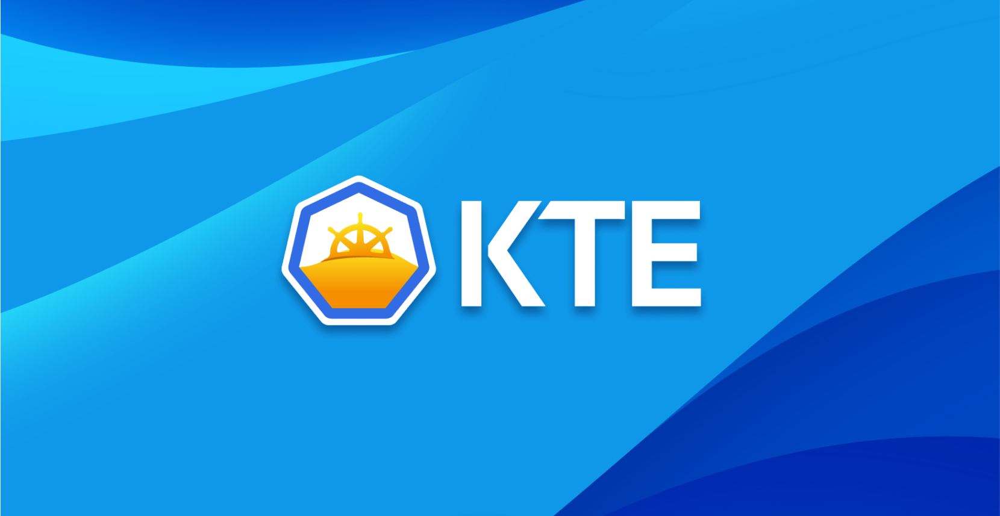
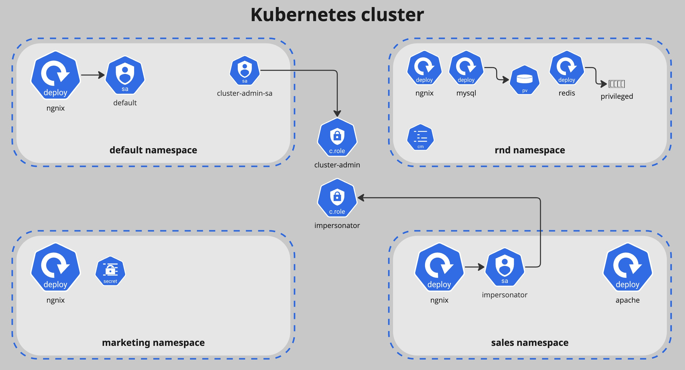

# KTE: Kubernetes Testing Environment
<div align="center">

</div>

<br/>

<div align="center">
  
![GitHub Stars][stars-badge]
![GitHub Fork][fork-badge]
[![License][license-badge]][license-url]

</div>

KTE (Kubernetes Testing Environment) is a vendor-agnostic project that lets you easily test different open-source security offerings on the fly. It currently supports:
* [polaris](https://github.com/FairwindsOps/polaris)
* [kor](https://github.com/yonahd/kor)
* [trivy-operator](https://github.com/aquasecurity/trivy-operator)
* [kubesec](https://github.com/controlplaneio/kubesec)
* [checkov](https://github.com/bridgecrewio/checkov)
* [kube-score](https://github.com/zegl/kube-score)

KTE can provision a Kubernetes cluster via Terraform on all 3 major CSPs (AWS, GCP and Azure), together with a predefined helm chart. A default test chart is provided, with plenty of misconfigurations described below.

We recommend users to fork this project and add a custom chart to utilize its power on a staging environment. If you do, make sure to configure the k8s nodes' on each cluster to meet your needs in terms of resources, size and scale. You can do it by editing each cluster's IaC project [here](https://github.com/orcasecurity/kte/tree/dev/deployment/clusters). GKE and AKS support integrated node autoscaling, for an EKS support please explore [karpenter](https://github.com/aws/karpenter-provider-aws).

## Blogpost / Write-up
A full introduction write-up of this project, including more information on how it works and what to expect - can be found in the [Orca Research Pod]().

## Default Helm


## Quick Start
### Prerequisites
The clusters, helm chart and most tools are provisioned using _Terraform_. _Go_, _Kubectl_ and _yq_ are also required. You must use a **Unix** machine OR activate WSL to run the main CLI tool. We also recommend installing and using _helm_ for troubleshooting and debugging purposes.

### Configuration
You will need to create a .tfvars for each vendor. Follow the details under [docs/configuration.md](https://github.com/orcasecurity/kte/blob/main/docs/configuration.md). 
```sh
git clone https://github.com/orcasecurity/kte.git
cd kte

mkdir deployment/vars
touch deployment/vars/{eks,gke,aks}.tfvars
```

### Running
Everything you can do is managed by the main CLI tool. Follow its help manual for more. It relies on relative paths, so make sure to run it from the root directory. 
```sh
./kte.sh
```

### Community
We encourage bug / feature requests through [discussions](https://github.com/orcasecurity/kte/discussions), as-well as general questions. Follow the [contribution guidelines](https://github.com/orcasecurity/kte/blob/main/CONTRIBUTING.md) for more information. When participating, please adhere to this project's [code of conduct](https://github.com/orcasecurity/kte/blob/main/CODE_OF_CONDUCT.md). Don't open issues as they will get immediately closed, maintainers triage discussions and then create issues.

### Disclaimer
> :warning: This project will carry cloud costs associated with the deployment of managed Kubernetes clusters. Since the project wil be potentially customed, the cost estimation is unexpected. By default, the following machine types are being used:
> * EKS: t3.large
> * GKE: e2-standard-4
> * AKS: Standard_D2s_v3
>
> Please make sure to do your due-diligence to avoid unexpected costs. All vendors work in a pay-as-you-go model with a **$0.10/hour** fee for the cluster's control-plane. The hourly prices of the default machine types above, on the used regions, are: **$0.0832**, **$0.1344** and **$0.096** respectively. The current estimated price for the default EKS testing environment is **$0.266/hour** (verified on August 14 2024). The owners and maintainers of this project aren't responsible for any unexpected cost.

[fork-badge]: https://img.shields.io/github/forks/orcasecurity-research/kte?logo=github
[stars-badge]:  https://img.shields.io/github/stars/orcasecurity-research/kte?logo=github
[license-badge]: https://img.shields.io/badge/License-Apache%202.0-blue.svg
[license-url]: https://github.com/orcasecurity-research/kte/blob/main/LICENSE

