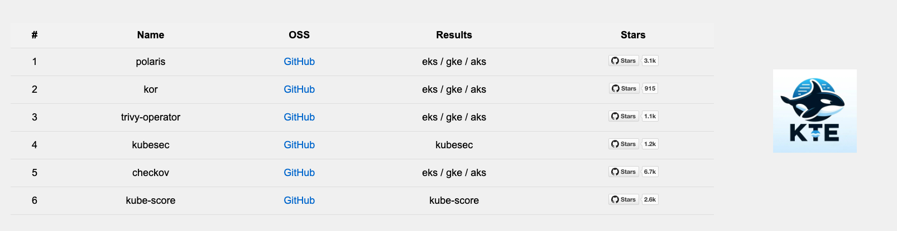

# Usage options
## Apply
Choosing `apply` will start executing and provisioning resources, according to _config.yaml_. Some open-source tools are static, and don't require a deployment, while others will trigger a Terraform provisioning proces.
As part of the execution, [index.html](https://github.com/orcasecurity/kte/blob/dev/dashboards/index.html) will get updated with links to the results dashboards. To access the dashboards you must tunnel to the relevant cluster's network.
> If the results dashboard is Grafana, search the name of the tool in the dashboards' search bar.

<details>
<summary>index.html</summary>

</details>


## Destroy
Using `destroy` will destroy all provisioned resources of tools, on all vendors. It will also clean the links on _index.html_ and remove assistant html files that were dynamically created. It can be configured to destroy all addons and also all clusters. Please note that the [prometheus](https://github.com/orcasecurity/kte/tree/master/deployment/addons/prometheus) addon is dynamically provisioned as part of the `apply` procedure.

## State
The `state` command may be your favorite one. It will output a yaml file that helps you understand the current state of the environment: the tools that were executed and the resources that are currently deployed.

Example:
* The environment has a deployed `EKS` cluster.
* `kubesec` and `kube-score` were executed, and their results can be seen on the main html file.
* `polaris` is deployed on EKS, and its results can be seen on the main html file.

```
eks: 🐋
gke: 
aks:

---

prometheus:
  eks:
  gke:
  aks:
ssh:
  eks:
  gke:
  aks:

---

kubesec: 🐋
kube-score: 🐋
polaris:
  eks: 🐋
  gke:
  aks:
kor:
  eks:
  gke:
  aks:
trivy-operator:
  eks:
  gke:
  aks:
checkov:
  eks:
  gke:
  aks:
```

## Tunnel
The `tunnel` command will execute `scripts/tunnel.sh`. Read more information [here](https://github.com/orcasecurity/kte/blob/master/deployment/addons/ssh/README.md).

Example:
```sh
./kte.sh tunnel eks
```

